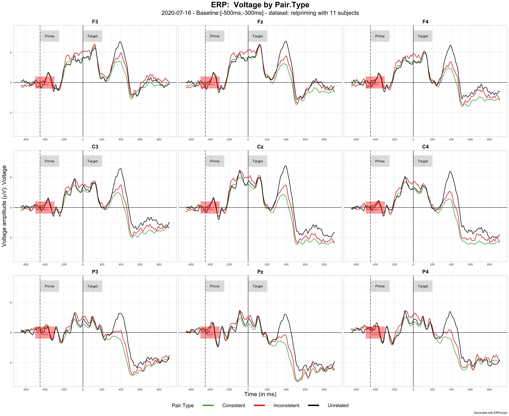

# ERPscope

A little package to visualize ERPs in R

FRIENDLY WARNING: The package is still under development. You can see below what are the planned improvements over the next couple of months.

## Table of Contents

- [Installation](#installation)
- [Update ERPscope](#update-erpscope)
- [Data specifications](#data-specifications)
- [Function plot_erp](#function-plot_erp)
- [Function plot_difference](#function-plot_difference)
- [Function plot_difference_maps](#function-plot_difference_maps)
- [Function generate_ERP_stats_table](#function-generate_ERP_stats_table)
- [Function plot_cor_with_erp_effect](#function-plot_cor_with_erp_effect)
- [Future developments](#future_developments)
- [Credits and other R ERP/EEG related packages](#future_developments)


## Installation

### Devtools package
To install ERPscope, install the devtools package if you don't already have it (https://www.rdocumentation.org/packages/devtools)
```r
install.packages("devtools")
```
### Installing ERPscope
Run the following command to install from the github repository
```r
 devtools::install_github("aherbay/erpscope")
```
* 2020-07-21 Sometimes the package rlang cannot update properly and needs to be removed from the R library folder. ( to know where are you packages folders stored, just run `.libPaths()` )


## Update ERPscope

```r
  detach("package:erpscope", unload=TRUE) #if ERPscope is loaded in your session
  devtools::install_github("aherbay/erpscope") # update
  library(erpscope) # loading again
```

## Data specifications

Your dataframe should have:
* one column named Voltage (numeric)
* one column named Subject (factor)
* one column named Time (integer)
* one column named Electrode (factor)
* one column for the conditionToPlot argument with the variable and levels to plot (factor)

## Function plot_erp 

* **function plot_erp with all arguments**

```r
plot_erp( data = relpriming,
          conditionToPlot = Pair.Type,
          electrodes_list =  c("F3", "Fz", "F4","C3", "Cz","C4", "P3", "Pz", "P4"),
          output_type = "pdf",
          color_palette =  c("#4DAF4A","#EA2721","#000000")  ,
          custom_labels = list(list(-450,-250,"Prime"),list(0,200,"Target")),
          show_conf_interval = FALSE,
          baseline = c(-500,-300),
          adjusted_baseline = FALSE,
          time_labels_interval = 200,
          plotname = 'auto',
          show_check_message = FALSE,
          labels_vertical_position = 'auto',
          labels_height = 'auto',
          vary ="Voltage"
) 
```

* **function plot_erp with only mandatory arguments**

```r
plot_erp( data = relpriming,
          conditionToPlot = Pair.Type,
          electrodes_list =  c("F3", "Fz", "F4","C3", "Cz","C4", "P3", "Pz", "P4"),
          color_palette =  c("#4DAF4A","#EA2721","#000000")  ,
          custom_labels = list(list(-450,-250,"Prime"),list(0,200,"Target")),
          baseline = c(-500,-300),
) 
```




*  **plot_erp with 95% bootstrapped confidence interval ribbons for each condition**

To show confidence interval ribbons, just set the argument  *show_conf_interval* to *TRUE* as below:
```r
plot_erp( data = relpriming,
          conditionToPlot = Pair.Type,
          electrodes_list =  c("F3", "Fz", "F4","C3", "Cz","C4", "P3", "Pz", "P4"),
          color_palette =  c("#4DAF4A","#EA2721","#000000")  ,
          custom_labels = list(list(-450,-250,"Prime"),list(0,200,"Target")),
          baseline = c(-500,-300),
          show_conf_interval = FALSE

) 
```


### plot_erp functionnalities

* **display ERP baseline** 

For now it is a mandatory argument. Display a red rectangle from the beginning to the end of the baseline time window.

* **change ERP baseline** 

You can adjust the ERPs to the baseline provided in the argument baseline by setting the argument **adjusted_baseline** to **TRUE**

* **add custom labels**

You can add custom labels for stimuli appearing, or specific time window. It appears a vertical dotted line at start time with a grey rectangle with the label on the top of the plot.

To add a label you need to add a list to the **custom_labels** argument (which is a list of lists, by default an empty list). 
The list defining a label has the structure : list(start_time, end_time, label). For example, to add a label displaying the word Prime between -450 ms and -250 ms, you would have : `custom_labels = list( list(-450,-250,"Prime") ) `


The position of label is automatic by default but it can be adjusted to your need by changing the argument **labels_vertical_position**  to the voltage you want the label to be centered on and the argument **labels_height** if you also want to change it's height (again in mV) 

* **output file form** 

By default, the file is exported to a PDF file. It is aslo possible to export it to png, jpeg, pdf, png, svg by changing the argument **output_type** to **"png"** for example.

* **plot name**

By default, the plot name is automatic. But it can be customized by changing the argument **plotname** 

* **show 95% confidence intervals**

By default, only the ERPs are displayed. But it is possible to add the 95% confidence intervals for each condition by setting the argument **show_conf_interval** to **FALSE**.

* **changing the colors of ERP lines**

By default there are 9 colors used to display ERPs : "#4DAF4A" (green), "#EA2721" (red), "#377EB8" (blue), "#FF7F00" (orange), "#984EA3" (purple), "#000000" (black), "#5c5c5c" (grey), "#945D25" (brown),"#FF748C" (pink), "#2E692C" (dark green).

To change the order of colors or to change them entirely, you can change the argument **color_palette**. For example, to put the colors red, blue, purple for 3 ERP lines `color_palette =  c("#EA2721","#377EB8","#984EA3")`. You can also use default values from R for example: `c("blue","red","black")`.

* **changing line thickness**

line_thickness = 0.75 by default

* **changing background format**

background = "grid" , "white" , "dark"


## Function plot_difference 

* function plot_difference with minimal arguments displaying 9 electrodes and voltages maps
```r
plot_difference( data = relpriming,
                 conditionToPlot = Pair.Type,
                 levelA = Unrelated ,
                 levelB = Consistent,
                 electrodes_to_display = c("F3", "Fz", "F4","C3", "Cz","C4", "P3", "Pz", "P4"),
                 topoplots_time_windows = list(c(-250,-150),c(-150,50),c(50,200),c(200,300),c(300,500),c(500,700),c(700,900)),
                 baseline= c(-500,-200))
```


* function plot_difference with all arguments displaying 9 electrodes and voltages maps

```r
plot_difference( data = relpriming,
                 conditionToPlot = Pair.Type,
                 levelA = Unrelated ,
                 levelB = Consistent,
                 output_type ='pdf',
                 ant_levels= Anteriority.Levels,
                 med_levels= Mediality.Levels,
                 vary= Voltage,
                 group_var = Subject,
                 show_group_obs = TRUE ,
                 labels_vertical_position = 'auto',
                 labels_height = 'auto',
                 baseline= c(-500,-200),
                 topoplots_time_windows = list(c(-250,-150),c(-150,50),c(50,200),c(200,300),c(300,500),c(500,700),c(700,900)),
                 topoplots_scale = c(-2,2),
                 time_labels_interval = 200,
                 custom_labels = list(list(-450,-250,"Prime"),list(0,200,"Target")),
                 electrodes_to_display = c("F3", "Fz", "F4","C3", "Cz","C4", "P3", "Pz", "P4"),
                 plotname = 'auto'
) 
```


* function plot_difference to display Subject individual data

You can display Subject data in light grey with show_group_obs = TRUE 

```r
plot_difference(  data = relpriming,
                  conditionToPlot = Pair.Type,
                  levelA = Unrelated ,
                  levelB = Consistent,
                  output_type ='pdf',
                  ant_levels= Anteriority.Levels,
                  med_levels= Mediality.Levels,
                  vary= Voltage,
                  group_var = Subject,
                  show_group_obs = TRUE ,
                  labels_vertical_position = 'auto',
                  labels_height = 'auto',
                  baseline= c(-500,-200),
                  topoplots_time_windows = list(c(-250,-150),c(-150,50),c(50,200),c(200,300),c(300,500),c(500,700),c(700,900)),
                  topoplots_scale = c(-2,2),
                  time_labels_interval = 200,
                  custom_labels = list(list(-450,-250,"Prime"),list(0,200,"Target")),
                  plotname = 'auto'
) 
```


* function plot_difference with all arguments displaying 9 ROI and voltages maps
 
 Instead of displaying difference on 9 specific electrodes you can display it on 9 Regions of Interest
 To do so, just remove the line, electrodes_to_display or put it electrodes_to_display = c()

```r
plot_difference(  data = relpriming,
                  conditionToPlot = Pair.Type,
                  levelA = Unrelated ,
                  levelB = Consistent,
                  output_type ='pdf',
                  ant_levels= Anteriority.Levels,
                  med_levels= Mediality.Levels,
                  vary= Voltage,
                  group_var = Subject,
                  show_group_obs = FALSE ,
                  labels_vertical_position = 'auto',
                  labels_height = 'auto',
                  baseline= c(-500,-200),
                  topoplots_time_windows = list(c(-250,-150),c(-150,50),c(50,200),c(200,300),c(300,500),c(500,700),c(700,900)),
                  topoplots_scale = c(-2,2),
                  time_labels_interval = 200,
                  custom_labels = list(list(-450,-250,"Prime"),list(0,200,"Target")),
                  plotname = 'auto'
) 
```


## Function plot_difference_maps 

* function plot_difference_maps with custom time windows

```r
  plot_difference_maps(  data = relpriming,
                         conditionToPlot = Pair.Type,
                         levelA = Unrelated ,
                         levelB = Consistent,
                         output_type ='pdf',
                         topoplots_time_windows = list(c(-250,-150),c(-150,50),c(50,200),c(200,300),c(300,500),c(500,700)),
                         topoplots_scale = c(-2,2),
                         plotname = 'auto'
  )
```


* function plot_difference_maps with fixed time windows

Precise in the fixed argument the start_time, end_time and time duration of your windows


```r
  plot_difference_maps(  data = relpriming,
                         conditionToPlot = Pair.Type,
                         levelA = Unrelated ,
                         levelB = Consistent,
                         output_type ='pdf',
                         fixed= c(-300,900,100), # init_time, end_time, step
                         topoplots_scale = c(-2,2),
                         plotname = 'auto'
  )
```


## Function generate_ERP_stats_table 

### mandatory arguments

* dataset 
* lmer model structure between quotes
* timeWindowMode : "custom" or "byStep"
* output name between quotes for the HTML file

* if timeWindowMode == "custom", you need to define your custom time windows on which you will perform analyses. 
  * custom_TW = list of vectors defining your time windows c(start_time, last_time)
* if timeWindowMode == "byStep", you need to define when to start, stop, and the time step (all in ms):
  * time_step=100, min_time=-300, max_time=900,


#### generate_ERP_stats_table with custom time windows
```r
 generate_ERP_stats_table( 
      data = relpriming,
      model_structure = "Voltage ~   Pair.Type + (1+ Pair.Type|Subject)",
      timeWindowMode="custom",
      custom_TW =  list(c(-300,-150),c(-150,50),c(50,200),c(200,300),c(300,500),c(500,700)),
      output_name="2020_07_02_PairTypeModels.html"
 ) 
```


#### generate_ERP_stats_table with custom time windows

```r
 generate_ERP_stats_table( 
      data = relpriming,
      model_structure = "Voltage ~   Pair.Type  + (1+ Pair.Type|Subject)",
      timeWindowMode="byStep",
      time_step=100, min_time=-300, max_time=900,
      output_name="2020_07_02_PairTypeModels.html"
 ) 
```

## Function plot_cor_with_erp_effect 
    
Function to compute the correlation between an ERP effect (between two conditions) between two specific times and another variable (e.g. behavioral, demographic) that exists for each subject
    
### mandatory arguments

* erpDataset 
* erp_var: ERP condition variable 
* erp_levelA: level A in A - B
* erp_levelB: levelB in A - B
* erp_start_time: 
* erp_end_time:

* behavDataset : dataset with the behavioral/demographic variable
* behav_var : behavioral/demographic variable
                                
                                 
```r
plot_cor_with_erp_effect ( erpDataset = relpriming2,
                     erp_var = Pair.Type ,
                     erp_levelA = Unrelated ,
                     erp_levelB =  Consistent,
                     erp_start_time = 700 ,
                     erp_end_time = 900,
                     behavDataset = relpriming_RT,
                     behav_var = Related_RTs,
                     subject_var = "Subject_short"
                     )    
```


## Future developments

Among various improvements and bug fixes, here are some planned development over the next couple of month

### plot_erp
- [x] Option to have negative or positive up 
- [ ] Split plotname into plot_filename and plot_title
- [ ] Make the baseline argument not mandatory and change its name to preprocessing_baseline
- [ ] Change the adjusted_baseline argument name to simulate_baseline 

### plot_difference
- [ ] Allow to make multiple comparisons defined in a pairwise manner


### plot_erp and plot_difference
- [ ] Move beyond 9 or 12 electrodes and display preselected layouts of electrodes
- [ ] Option to automatically put labels below ERPs and not only above
- [ ] Define different colors for labels
- [ ] Option to adjust font sizes of various elements
- [ ] Repeat Voltage scale 
- [ ] Define custom scale limits for Voltage in ERP plots
- [ ] Offer multiple CI computation options/ standard error option
- [ ] Input custom electrodes layouts for voltage maps
- [ ] Allow to define ROI in a better way
- [ ] Offer various color scale for voltage maps and change the default one

### plot_cor_with_erp_effect
- [ ] Input specific custom ROI
- [ ] Replace regression line by correlation line


### generate_ERP_stats_table
- [ ] Improve the table output: more details on dataset
- [ ] The table should report that some models do not converge properly
- [ ] Fix the warning regarding the nonempty <title> element in the HTML file
- [ ] Allow to output the table into an editable word document
- [ ] Allow to run linear models (not mixed-models)

## Other R ERP/EEG related packages 

- [eegUtils](https://github.com/craddm/eegUtils) by Matt Craddock
- [eeguana](https://github.com/bnicenboim/eeguana) by Bruno Nicenboim 
- [erpinr](https://erpinr.org) by David Causeur and Ching-Fan Sheu


## Acknoledgements

I would like want to thank my supervisor Karsten Steinhauer and my labmates for their support and feedback, as well as people who visited my poster at the LiveMEEG 2020 conference and gave me feedback to improve the package. Finally special thanks to Matt Craddock, his blog and work served as an inspiration and basis for ERPscope.


